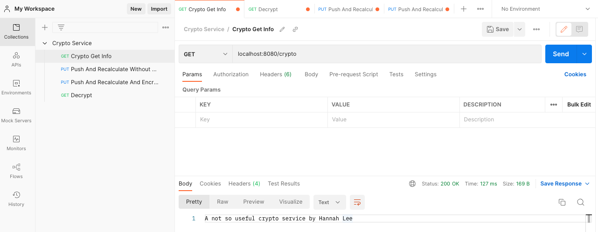
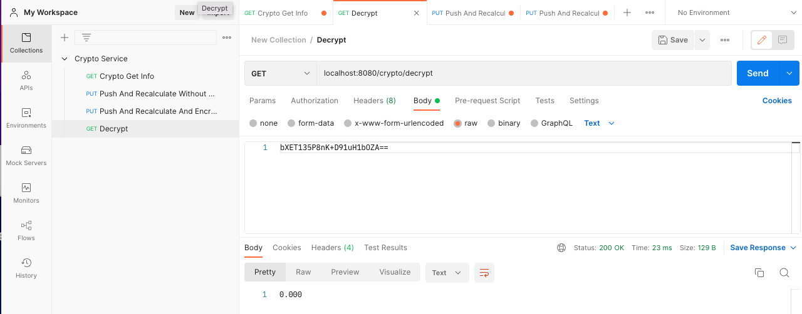
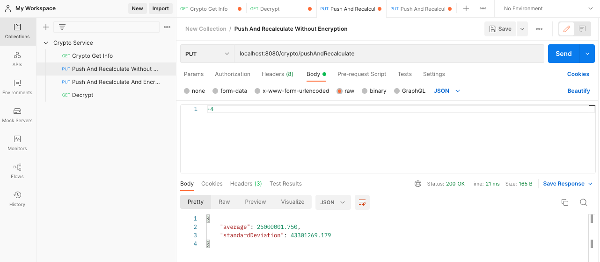
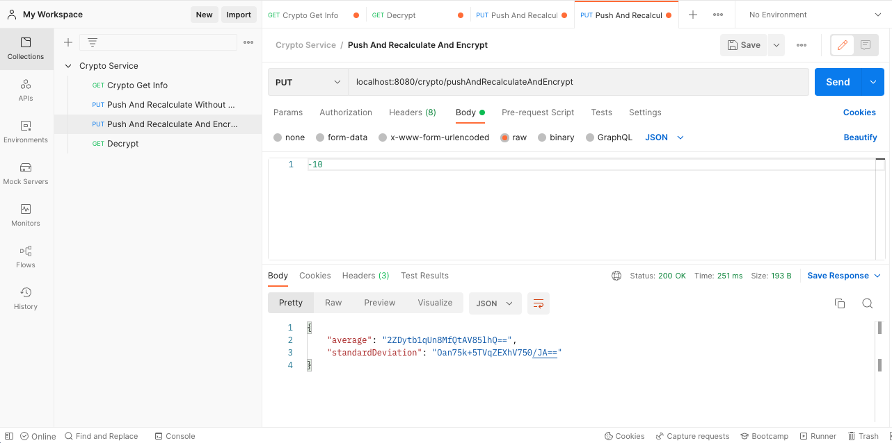

# CryptoService

How to start the CryptoService application
---

1. Run `mvn clean install` to build your application
1. Start application with `java -jar target/dummy-crypto-service-1.0-SNAPSHOT.jar server config.yml`
1. To check that your application is running enter url `http://localhost:8080`

Health Check
---

To see your application's health enter url `http://localhost:8081/healthcheck`

## How to use the API Locally
API is easy to interact with using Postman (https://www.postman.com/downloads/).
Import the Postman Collection `Crypto Service.postman_collection.json` from the root directory, and you will see 2 GETs, and 2 PUTs.
1. GET - `localhost:8080/crypto` (home path)

2. GET - `localhost:8080/crypto/decrypt`
    1. Under `Body`, select `raw` and `Text`. Use this path so decrypt any encrypted stats you with you view.

3. PUT - `localhost:8080/crypto/pushAndRecalculate`
    1. Under `Body`, select `raw` and `JSON`. Type in any valid Long numbers as an input.

4. PUT - `localhost:8080/crypto/pushAndRecalculateAndEncrypt`
    1. Under `Body`, select `raw` and `JSON`. Type in any valid Long numbers as an input.

## Assumptions & Decisions
1. Input numbers are integers, as shown in the example. The application uses Long as the integer format. For the actual calculations, the numbers are transformed to BigDecimals.
2. All decimals are rounded half-up to 3 digits, but the full BigDecimal scale is used in the backend calculations.
3. Negative numbers are allowed.
4. There is no use case for storing historical data, since only running stats are used. Hence, there is no database or cache to store inputs.
5. There is only single key used for encryption/decryption, so this is generated & statically used within the CryptoUtils class. The key is not revealed to the API user.
6. No authentications.

## Setup
Environment
- Java 18.0.1.1

Project Management Tool
- Maven 3.8.6

Package Management Tool
- Homebrew

Cryptography Algorithm
- AES Algorithm
